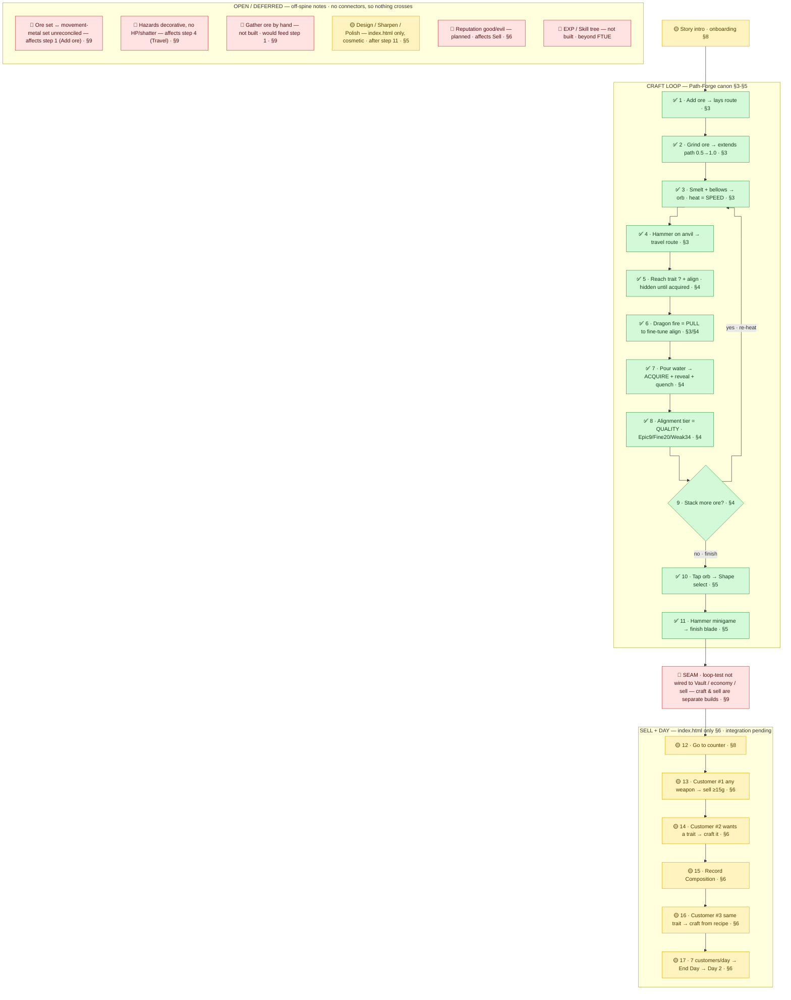

# Sword Forge — FTUE Flow (tri-color, SSOT-keyed)

Corrected FTUE flow for the **Path-Forge** direction, keyed to `specs/game-design.md` (SSOT, post-`16746d9`). Built from your FigJam draft + Potion Craft FTUE + the shipped `swordforgeV2` tutorial + the `Swordforge_new_looptest.html` canon.

## Legend — maps to the SSOT's two-build split (`game-design.md:5`)

| Tag | Meaning | Where it lives |
|-----|---------|----------------|
| ✅ **Path-Forge canon** | crafting/movement loop, built in the loop-test | `Swordforge_new_looptest.html` · SSOT §3–§5 |
| 🟡 **index.html only** | economy/UI/onboarding; **integration into Path-Forge still open** | `index.html` · SSOT §6–§8 |
| 🔴 **unbuilt / decide** | in no build yet, or an open seam the SSOT flags | SSOT §9 / not present |

> The whole flow **crosses the seam the SSOT calls open** (`game-design.md:184`): the ✅ craft half is a standalone 9:16 build **not yet wired to the Vault, economy, or selling** (the 🟡 half). Treat this as a **target design across two un-merged builds**, not a shippable single flow yet.

---

## The flow (linear, tagged)

**0. Story intro** 🟡 — 4-scene animated intro (onboarding is index.html · §8).

**CRAFT LOOP — ✅ Path-Forge canon (§3–§5):**
1. **Add ore** → lays a route segment on the map. ✅ §3 (`:38`)
2. **Grind ore** in mortar → extends the path `0.5→1.0`. ✅ §3 (`:42`)
3. **Smelt + bellows** → glowing orb; **heat = travel SPEED** (not acquire). ✅ §3 (`:48`)
4. **Hammer on anvil** → drives the sword along the route. ✅ §3 (`:53`)
5. **Reach trait `?` + align** — all traits hidden as `?` until acquired. ✅ §4 (`:63`)
6. **Dragon fire = PULL to fine-tune alignment** — not heat, not reset. ✅ §3/§4 (`:56`)
7. **Pour water** → **ACQUIRE + reveal + quench**. ✅ §4 (`:65`)
8. **Alignment tier = QUALITY** — Epic ≤9 / Fine ≤20 / Weak ≤34. ✅ §4 (`:74`)
9. **Stack more ore?** → re-heat, travel further, acquire more traits (loop back to 3), or finish. ✅ §4 (`:72`)
10. **Tap orb → Shape select** (Short/Long/Broad). ✅ §5 (`:83`)
11. **Hammer minigame → finish blade** (misses cosmetic). ✅ §5 (`:85`)

**SELL + DAY — 🟡 index.html only (§6), integration pending:**
12. **Go to counter.** 🟡 §8
13. **Customer #1 "any weapon"** → sell (≥15g). 🟡 §6 (`:104`)
14. **Customer #2 wants a trait** (Flame) → back to forge, craft it. 🟡 §6 (`:105`)
15. **Record Composition** (blueprint). 🟡 §6 (`:152`)
16. **Customer #3 same trait** → Auto-Craft from the recipe (**graduation**). 🟡 §6 (`:106`,`:157`)
17. **7 customers/day → End Day → Day 2.** 🟡 §6 (`:128`)

**META / DEFERRED:**
- **Design / Sharpen / Polish** 🟡 — index.html only, cosmetic; **dropped in the loop-test** (§5 `:86`). *Your "impact on gold value" is true only on the index.html side (hammer/sharpen craft-bonus, §6 `:120`) — not in Path-Forge canon.*
- **Diary + Quests** 🟡 — §6/§8.
- **Gather ore by hand** 🔴 — not built (loop-test pre-stocks; index.html auto-generates via smelter). §9 (`:186`).
- **Gain EXP → Skill tree** 🔴 — in no build. Beyond FTUE.
- **Reputation good/evil path** 🔴 planned (numeric rep 🟡 exists). §6 (`:119`).

## Open seams (🔴 — decide before unifying)
- **Loop-test ↔ economy not wired** — forged sword has no gold value / Vault / sell yet. §9 (`:184`). *This blocks steps 11→12.*
- **Ore set ↔ movement-metal set** unreconciled — `{copper,iron,gold,aluminium,ember,frost,tide,gale}` vs `{steel,iron,magnesium,bronze,…}`. §9 (`:186`). *Hits the "Add ore / names" teach directly.*
- **Hazards decorative** in loop-test (no HP/shatter). §3/§9 (`:187`). *Don't teach a risk that does nothing yet.*

## Delta vs your FigJam draft

| Your node | Verdict | Fix |
|-----------|---------|-----|
| Story Intro | ✅ keep | tag 🟡 onboarding |
| Crafting Loop (Add/Grind/Bellow/Hammer/**Dragon heating**/Water/MAP) | ⚠️ mostly right | **"Dragon heating" → "Dragon: pull to fine-tune align"** (§3 `:56`) |
| — (missing) | ❌ add | **Alignment tier = quality** (§4 `:74`) — the core quality teach |
| — (missing) | ❌ add | **Trait `?` discovery** (§4 `:63`) |
| — (missing) | ❌ add | **Shape select + finish hammer** (§5 `:83`) |
| Gain EXP → Skill Tree | 🔴 | move off spine — unbuilt |
| Optional Designing/sharpening/polishing + gold | 🟡 | cosmetic; gold-impact is index.html-only, gone in canon |
| Saving recipes | 🟡 | = Record Composition (§6) |
| Selling + popularity | 🟡 | encode the request escalation (any → specific → repeat) |
| Diary + Quests | 🟡 | fine, tag |
| Gathering ore | 🔴 | not built — defer, don't bury at step 9 |
| Day night cycle | 🟡 | = End Day → Day 2 |

---

## FigJam-ready Mermaid

Paste the block below into FigJam (import steps follow). Color is encoded **both** in `classDef` **and** in the ✅/🟡/🔴 emoji on every label — so the tri-color reads even if FigJam drops the fills.



## How to import into FigJam (exact)

**Method A — Mermaid plugin (most reliable, keeps native editable nodes):**
1. Open your FigJam board. Press **Shift + I** (Resources) → **Plugins** tab.
2. Search **"Mermaid"** → run a Mermaid-to-FigJam plugin (e.g. **"Mermaid to Figma/FigJam"** or **"Figma to Mermaid / Mermaid.js"**).
3. Paste the block **between** the ```` ```mermaid ```` fences (not the fences themselves).
4. **Generate / Insert** → nodes drop onto the canvas as real FigJam shapes + connectors.

**Method B — SVG fallback (no plugin, pixel-exact):**
1. Go to **mermaid.live**, paste the same block.
2. **Actions → Export → SVG** (or PNG).
3. **Drag the SVG file onto the FigJam canvas** — it lands as editable vectors and **keeps the fill colors**.

### Caveats
- **Colors:** FigJam's Mermaid importer may ignore `classDef` fills. The ✅/🟡/🔴 emoji guarantee the coding survives; after import you can rubber-band-select by color and recolor to FigJam stickies (green/yellow/red) in one pass. Method B keeps the exact fills.
- **Line breaks:** if a node shows a literal `<br/>`, this block avoids them (uses `·` separators) so it imports clean.
- **Subgraphs** import as FigJam **sections** (CRAFT / SELL / OPEN) — handy for the tri-zone layout.
- **Edit the SSOT of this diagram here**, re-export — don't hand-edit in FigJam then lose it on re-import.

### Bent (elbow) connectors, not straight
The `%%{init … 'curve':'step'}%%` line makes lines right-angled — this carries into **Method B (SVG)** directly. For **Method A (plugin)** and for the board you've already imported, set it on the FigJam side:
1. **Ctrl/Cmd + A** to select everything (or drag a box around the diagram).
2. In the selection toolbar, open the **connector-style** control (the line-shape icon) → choose **Bent** (elbow). All connectors switch at once.
3. If a mixed selection hides that control, click one connector, then **Shift-click** the rest (or right-click a line → *Select all connectors* where available) and set **Bent**.
4. Optional cleanup: with lines bent, nudge the three OPEN/DEFERRED stickies so the dashed cross-links (`blocks 11→12`, `needs wiring`) run as clean L-shapes instead of long diagonals.
